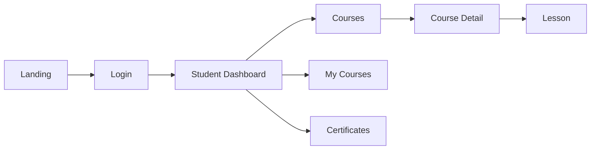

# EduKanda Frontend

Aplicação frontend do EduKanda, preparada para uso com backend real e com fallback para mocks em desenvolvimento.

## Requisitos

- Node 18+
- pnpm (recomendado) ou npm/yarn

## Instalação e Execução

```bash
pnpm install
pnpm dev
# ou
npm install
npm run dev
```

## Variáveis de Ambiente

Crie um arquivo `.env` na raiz do projeto:

```
VITE_API_URL=http://localhost:8000/api
```

- Quando `VITE_API_URL` está definido, os serviços usam a API real.
- Quando não está definido, há fallback para dados mockados existentes.

## Estrutura de Pastas (parcial)

```
src/
  components/
  context/
  data/                 # mocks existentes
  hooks/                # hooks customizados (useCourses, useCourse, useUser, useUserProgress)
  pages/
    public/
    student/
    teacher/
    admin/
  routes/
  services/            # http (Axios) e api
  types/               # tipos globais (Course, Lesson, User, Comment)
  utils/
```

## Estrutura de Dados (Mock/API)

Tipos principais em `src/types`:

```ts
// UserRole: 'student' | 'teacher' | 'admin'
export interface User {
  id: number;
  name: string;
  email: string;
  password: string;
  role: UserRole;
  avatar: string;
  bio: string;
  joinedDate: string;
  coursesCompleted: number;
  coursesInProgress: number;
  totalHoursWatched: number;
  certificates: number;
  points: number;
  rank: number;
}

export interface Lesson {
  id: number;
  title: string;
  duration: string;
  videoUrl: string;
  completed?: boolean;
  materials?: Array<{ title: string; url: string; type: string }>
}

export interface Course {
  id: number;
  title: string;
  category: string;
  description: string;
  instructor: string;
  instructorAvatar?: string;
  thumbnail?: string;
  duration?: string;
  lessonsCount?: number;
  studentsCount?: number;
  rating?: number;
  progress?: number;
  isFavorite?: boolean;
  lessons: Lesson[];
}

export interface Comment {
  id: number;
  userId: number;
  userName: string;
  userAvatar: string;
  courseId: number;
  lessonId?: number;
  content: string;
  timestamp: string;
  likes: number;
}
```

## Preparado para Backend Real

- `src/services/http.ts` (Axios):
  - Base URL: `VITE_API_URL`.
  - Interceptor de request adiciona `Authorization: Bearer <token>` quando há `token` no `localStorage`.
  - Interceptor de response delega tratamento para `handleApiError`.
- `src/services/api.ts`:
  - Usa `http` (Axios) quando há `VITE_API_URL`.
  - Fallback para mocks existentes quando não há.
- `src/utils/handleApiError.ts`:
  - Normaliza erros (Axios/fetch) em um formato consistente: `{ message, status, details }`.

### Hooks customizados

- `useCourses(params?)` – lista de cursos com `loading`/`error`.
- `useCourse(id)` – detalhe do curso com `loading`/`error`.
- `useUser(userId?)` – obter/atualizar usuário (`refresh`, `update`).
- `useUserProgress()` – progresso do usuário (lista de cursos em andamento).

### Rotas e Guardas

- Uso de React Router v6 com `Outlet` e guardas (público/estudante/professor/admin).
- Rotas de estudante (exemplos):
  - `/student/courses`
  - `/student/course/:id`
  - `/student/course/:courseId/lesson/:lessonId`

## Scripts úteis

```bash
pnpm dev           # modo desenvolvimento
pnpm build         # build de produção
pnpm preview       # pré-visualização do build
pnpm lint          # lint
```

## Padrões e Decisões

- Tipos globais centralizados em `src/types`.
- Sem adoção de ShadCN/UI (por escolha do projeto).
- Interceptores Axios para token JWT e tratamento de erros.
- Fallback para mocks para facilitar prototipagem.

## Screenshots (opcional)

- Coloque imagens em `public/screenshots/` e referencie aqui:

```


```

## Diagrama (opcional – Mermaid)



## Notas de Desenvolvimento

- Certifique-se de definir `VITE_API_URL` para usar o backend real.
- O token JWT é salvo em `localStorage` como `token`.
- Ajuste de CORS pode ser necessário no backend em desenvolvimento.
